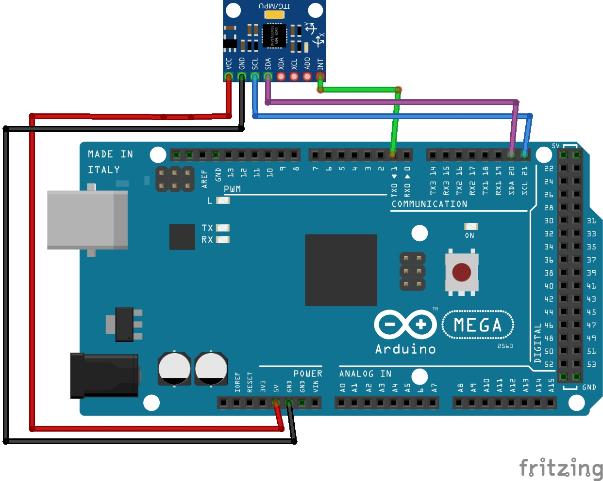

# Teleoperate-a-Robot-in-ROS-using-Hand-Gestures

P.S: I have reffered to Lentin Joseph Sir's ***"ROS ROBOTICS PROJECT"*** book for this project.

## Pre-requisite:
1) Have ROS and Rosserial set up on your PC/Laptop.
2) Install MPU-6050 library by _Electronic Cats_ in your Arduino IDE.

## Hardware used: 
- Arduino Mega
- IMU MPU-6050 (for MPU 9 series you can refer to the book directly)
- Jumper Cables
      
## Connections:
<!---  -->

  

 The IMU interfaces with Arduino board using the I2C protocol.

## Procedure: 
After coonections done properly 
1. Plug in your Arduino; Compile and Upload ***mpu6050_ros_ypr.ino*** file
2. Open terminal and run following commands:
   - $ roscore
   - $ rosrun rosserial_python serial_node.py /dev/ttyACM0 (the port where Arduino is connected)
   - check if the topic "imu_data" and "tf" is active using the command: 
     - $ rostopic list

### To view imu_frame in Rviz
$ rosrun rviz rviz -f base_link (Add tf topic in rviz window) 

### To control a bot in gazebo 
$ roslaunch guido_sim_description gazebo.launch (or any your custom made bot) 

## How code works ? :
Arduino code (***mpu6050_ros_ypr.ino***) in the script folder computes the orientation values from the IMU and send it to PC through the rosserial protocol. 
These orientation values are recieved by PC as ROS topics (/tf, /imu_data,etc) and are converted into twist messages using a ROS node (***imu_controller_ypr.py***). 
These twist messages are then published to  "/cmd_vel"  topic to operate the bot in Gazebo.

### Hand movement vs Robot motion:

  

 Where the Roll about X Axis is responsible for Left and Right turn motion and  
Pitch about Y axis produces front and back motion.

## Final Product

  

  

